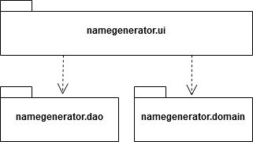
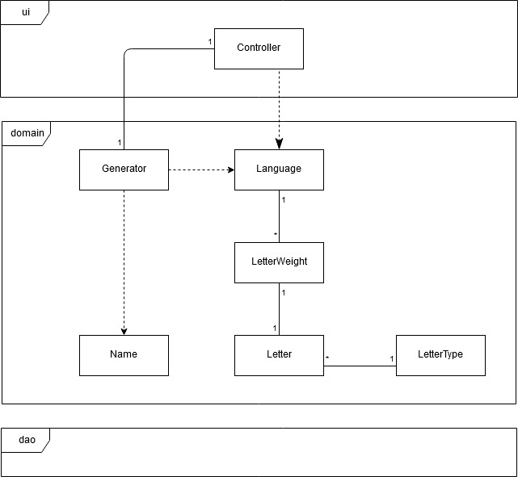
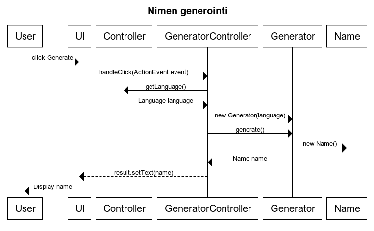
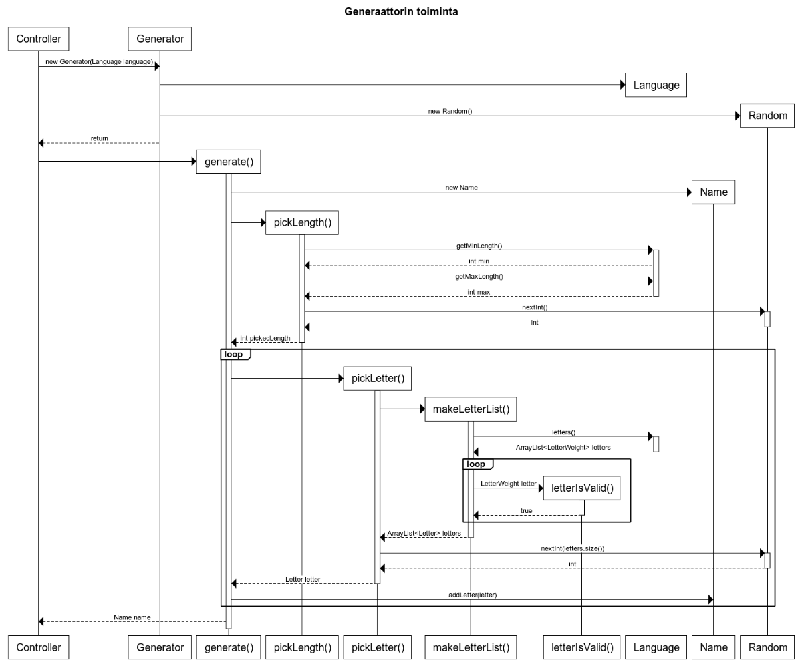

# Pakkausrakenne

# Luokkakaavio

# Sovelluslogiikka
Alla yleiskatsaus nimen generointiin. Kun käyttäjä klikkaa Generate-nappia, käsittelee controlleri 
klikkaustapahtuman ja kutsuu Generator-luokkaa. Generaattori palauttaa sen Name-luokan olion, 
jonka sisältämän tuloksen Controlleri tulostaa käyttäjän ruudulle.

## Generaattori yksityiskohtaisemmin
Kun kutsutaan Generaator-luokan `generate()`-metodia, tapahtuu kulissien takana useita välivaiheita.

Aivan aluksi generaattori luo tyhjän nimiolion, jolloin mahdolliset aikaisemmat tulokset nollaantuvat. 
Tämän jälkeen generoitavalle nimelle arvotaan satunnainen pituus, jonka ylä- ja alaraja on määritelty Language-luokassa.

Kun haluttu pituus on nyt selvillä, pyrkii generaattori poimimaan tarjolla olevista kirjaimista sellaisen, 
joka vastaa käyttäjän asettamia vaatimuksia. Tämä tapahtuu muodostamalla kaikista kirjaimista lista niin, että
lista sisältää painotuksen verran kutakin kirjainta. Jos siis esim. kirjaimen A painotus on 5 ja kirjaimen B painotus on 2,
eikä muita kirjaimia ole, olisi listan pituus 7, missä A-kirjaimia on viisi kappaletta ja B-kirjaimia kaksi.

Kaikki kirjaimet eivät kuitenkaan ole sallittuja toistensa perässä. Jos esimerkiksi kielessä on määrätty
ettei perättäisiä konsonentteja saa olla, hylkää generaattori listan luomisen yhteydessä kaikki konsonantit 
tapauksissa, joissa viimeisin valittu kirjain on jo konsonantti. 
Kirjainten oikeellisuudesta huolehtii `letterIsValid()`-metodi, jota `makeLetterList()` kutsuu kirjainlistan
kokoamisen yhteydessä. Näin `pickLetter()`-metodi saa aina listan, jossa jokainen vaihtoehto *on* sallittu.

Tapauksissa, joissa mahdollisia kirjaimia ei ole ollenkaan, palautetaan lyhyempi nimi kuin mitä alunperin arvottiin.
Toisin sanoen `pickLength()` määrää oikeastaan nimen *maksimipituuden*: generointi lopetetaan, kun `pickLetter()`
palauttaa tyhjää, tai kun haluttu pituus on saavutettu.

