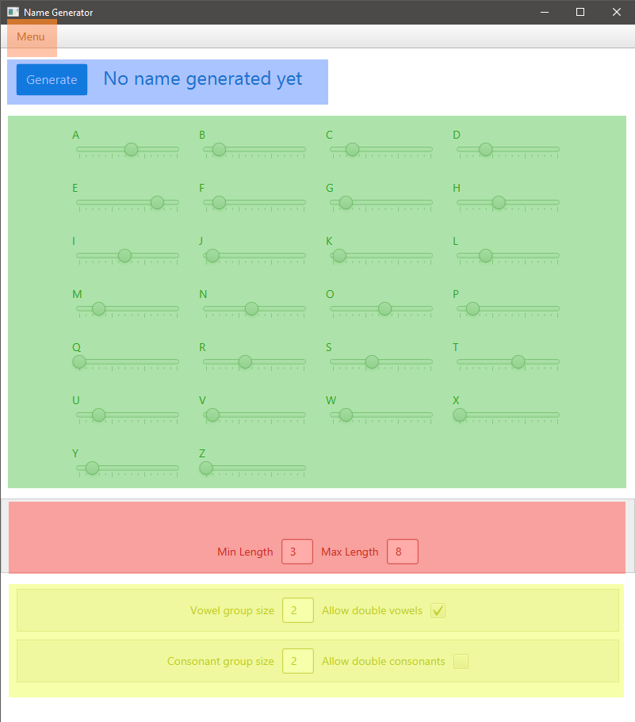

# Pakkausrakenne
Ohjelma rakentuu kahdesta sovelluskerroksesta, joista alempi on jakautunut datan tallentamiseen ja sovelluslogiikkaan:

`namegenerator.ui` sisältää JavaFX:ää hyödyntävän käyttöliittymän ja siihen liittyvät controller-luokat. 

`namegenerator.domain` sisältää sovelluslogiikan ja dataoliot.

`namegenerator.dao` sisältää tietojen tallentamisesta vastaavat luokat.

# Käyttöliittymä
Käyttöliittymässä on yksi näkymä, joka jakautuu useampaan osioon:

Osiot ovat ylhäältä alas seuraavat:
* Oranssi: valikko (`MenuController`)
* Sininen: generaattori (`GeneratorController`)
* Vihreä: kirjainpainotukset (`LettersController`)
* Punainen: nimen pituus (`LengthSelectionController`)
* Keltainen: kirjainryhmittymät (`LetterConfigController`)

Näkymät rakentuvat FMXL-tiedostoista, jotka elävät omissa tiedostoissaan kansiossa `src/main/resources/fxml`. 
Ulkoasun tyylit on eritelty tiedostoon `src/main/resources/styles/stylesheet.css`.

Osioiden controllerit vastaavat kukin oman osionsa päivittämisestä ja tapahtumahallinnasta. 
Kun sovelluksen tila muuttuu, pääcontrolleri (`Controller`) kutsuu näiden controllerien metodia `render()`,
jolloin osiot päivittyvät synkronoidusti.

# Luokkarakenne

Yllä luokkien tärkeimmät yhteydet ja niiden pakkaukset. 

### UI-luokista
`namegenerator.ui`-pakkauksessa elävä `Controller` saa JavaFX:n 
konvention mukaisesti referenssin näkymän alacontrollereihin (eng. nested controllers). Tiedonkulun helpottamiseksi 
kaikille alacontrollereille annetaan myös sovelluksen käynnistämisen yhteydessä viite pääcontrolleriin.

Pääcontrolleri hallinnoi riippuvuuksia olioihin, jotka vaikuttavat koko sovelluksen toimintaan. 
Tämän lisäksi alacontrollereilla voi olla välillisiä tai suoria riippuvuuksia alempaan sovelluskerrokseen. 

**Miksi useat controllerit?** Syitä jaolle on useita. Tärkein syy on, että ulkoasun osiot on näin mahdollista jakaa 
itsenäisiin FXML-tiedostoihin, jolloin ulkoasun rakenne on helpommin hahmotettavissa koodista. JavaFX olettaa, että
jokaisella tiedostolla on jokin controlleri, jolloin Single Responsibility Principlen hengessä on luontaista 
antaa jokaiselle tiedostolle myös itsenäinen controllerinsa: pääcontrolleri ei toisin sanoen täyty sekavista, toisiinsa
liittymättömistä metodeista, vaan jokaisen osion logiikasta vastaa oma controller-luokkansa.

# Sovelluslogiikka
Alla yleiskatsaus nimen generointiin. Kun käyttäjä klikkaa Generate-nappia, käsittelee `GeneratorController` 
klikkaustapahtuman ja kutsuu `Generator`-luokkaa. Generaattori palauttaa sen `Name`-luokan olion, 
jonka sisältämän tuloksen controlleri tulostaa käyttäjän ruudulle.

## Generaattori yksityiskohtaisemmin
Kun kutsutaan `Generaator`-luokan `generate()`-metodia, tapahtuu kulissien takana useita välivaiheita.

Aivan aluksi generaattori luo tyhjän nimiolion, jolloin mahdolliset aikaisemmat tulokset nollaantuvat. 
Tämän jälkeen generoitavalle nimelle arvotaan satunnainen pituus, jonka ylä- ja alaraja on määritelty `Language`-luokassa.

Kun haluttu pituus on nyt selvillä, pyrkii generaattori poimimaan tarjolla olevista kirjaimista sellaisen, 
joka vastaa käyttäjän asettamia vaatimuksia. Tämä tapahtuu muodostamalla kaikista kirjaimista lista niin, että
lista sisältää painotuksen verran kutakin kirjainta. Jos siis esim. kirjaimen A painotus on 5 ja kirjaimen B painotus on 2,
eikä muita kirjaimia ole, olisi listan pituus 7, missä A-kirjaimia on viisi kappaletta ja B-kirjaimia kaksi.

Kaikki kirjaimet eivät kuitenkaan ole sallittuja toistensa perässä. Jos esimerkiksi kielessä on määrätty
ettei perättäisiä konsonentteja saa olla, hylkää generaattori listan luomisen yhteydessä kaikki konsonantit 
tapauksissa, joissa viimeisin valittu kirjain on jo konsonantti. 
Kirjainten oikeellisuudesta huolehtii `letterIsValid()`-metodi, jota `makeLetterList()` kutsuu kirjainlistan
kokoamisen yhteydessä. Näin `pickLetter()`-metodi saa aina listan, jossa jokainen vaihtoehto *on* sallittu.

Tapauksissa, joissa mahdollisia kirjaimia ei ole ollenkaan, palautetaan lyhyempi nimi kuin mitä alunperin arvottiin.
Toisin sanoen `pickLength()` määrää oikeastaan nimen *maksimipituuden*: generointi lopetetaan, kun `pickLetter()`
palauttaa tyhjää, tai kun haluttu pituus on saavutettu.

# Tietojen pysyväistalletus
Pakkauksen `namegenerator.dao` luokka `LanguageDao` vastaa tiedon tallentamisesta tietokantaan. 
Tällä hetkellä tämä merkitsee SQLite-tiedostoa `database.db`, joka luodaan tarpeen mukaan kielen tallentamisen yhteydessä.