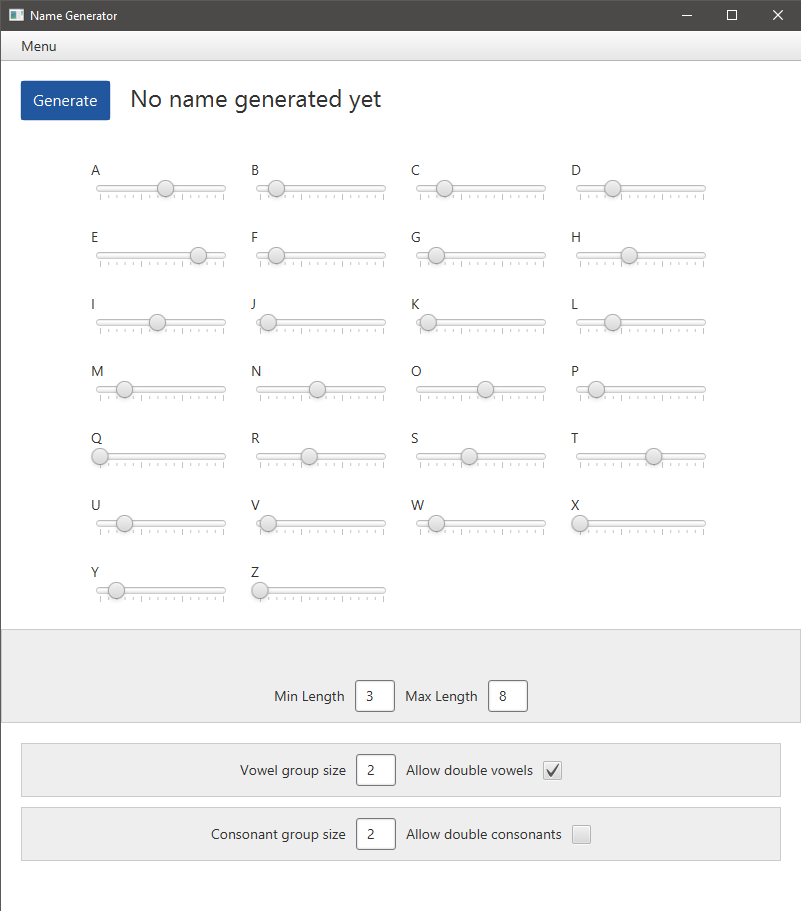
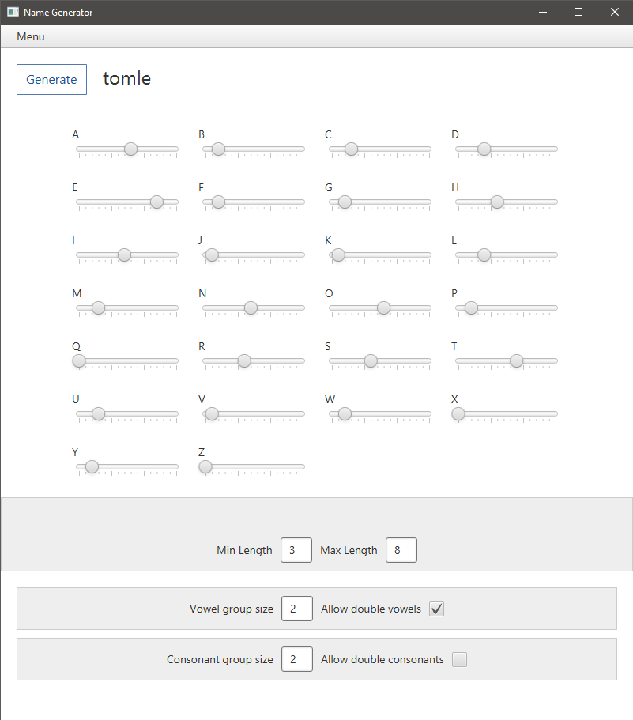
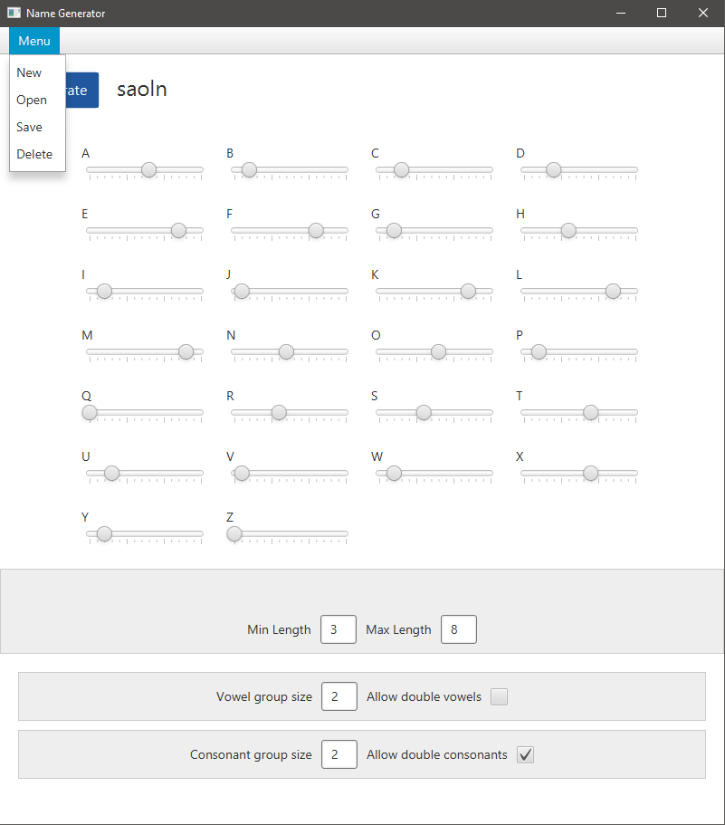

# Käyttöohje
Lataa sovelluksen viimeisin release [täältä](https://github.com/Siipis/ot-harjoitustyo/releases).

### Riippuvuudet
Sovellus olettaa, että SQLite on käytettävissä. Jos SQLite puuttuu, sen voi asentaa [täältä](https://www.sqlite.org/).

## Generaattorin käyttäminen
Sovellus käynnistyy seuraavaan näkymään:

Generate-nappia painamalla sovellukseen tulostuu kieliasetusten mukainen nimi. Nappia uudestaan 
painamalla nimi korvautuu uudella.

Alla on kielen konfiguraattori, joka muodostuu kirjainpainotusten säädöistä, nimen 
minimi- ja maksimipituuden asetuksista sekä kirjainten ryhmittymisasetuksista.

### Kielen konfigurointi

Kirjainten esiintymistodennäköisyyttä voi säätää ylöspäin vetämällä kirjainkohtaista säädintä oikealle, 
tai halutessaan poistaa kirjaimen käytöstä kokonaan vetämällä säätimisen kokonaan vasempaan.
Nimen lyhyin halutun pituuden voi asettaa "Min Length" -kentästä ja vastaavasti pisimän "Max Length" -kentästä.

Alemmat kentät liittyvät kirjainten ryhmittymiseen. Jos esimerkiksi kaksi peräkkäistä vokaalia on sallittu
("Allow double vowels"), nimeksi on mahdollista tulla esim. *Oo*na. Samaten kun tuplakonsonantit sallitaan
("Allow double consonants"), mahdollinen tulos voisi olla Ma*tt*i. 

Vokaali- ja konsonanttiryhmät toimivat samalla periaatteella, mutta kirjaintyyppien muodossa. Jos korkein 
sallittu vokaaliryhmä on 3, voisi tulos esimerkiksi olla T*iia*. Vokaali- ja konsonantiryhmissä on hyvä ottaa
huomioon, että niihin luetaan myös yllä mainitut tuplakirjaimet. Näkymässä tämä näkyy sillä, että jos 
kirjaintyypin ryhmäkokoa laskee, kääntyy myös tuplakirjaimet pois päältä.

HUOM! Nykyisessä sovelluksen versiossa Y katsotaan joko vokaaliksi tai konsonantiksi. 
Näin, koska sovelluksen oletuskieli on englanti. Tulevassa versiossa käyttäjä voisi itse muuttaa kunkin 
kirjaimen tyyppiä haluamakseen.

### Nimen tallentaminen ja lataaminen

Ylänurkan Menu:ta klikkaamalla saa auki valikon, jolla voi luoda uuden nimen (jolloin asetukset palautuvat oletusarvoihin)
tai hallita tallennettuja nimiä. 

Tallentamisen yhteydessä (Menu -> Save) sovellus kysyy nimeä, joka voi joko olla kokonaan uusi nimi tai jo tallennettu nimi. 
Jos samalla nimellä on jo olemassa tallennus, vanha versio korvautuu uudella. Kun tallennus on tehty, kielen voi 
ladata tai poistaa valitsemalla sen listalta klikattuaan Open tai Delete.

### Virheen sattuessa
Jos kieliasetukset ovat virheellisiä, tulostuu virheilmoitus eikä nimeä voi generoida ennen virheen korjaamista.
Virheellistä kieltä ei voi myöskään tallentaa. Virheestä pääsee eroon joko muuttamalla kieliasetuksia tai valitsemalla
valikosta Menu -> New.