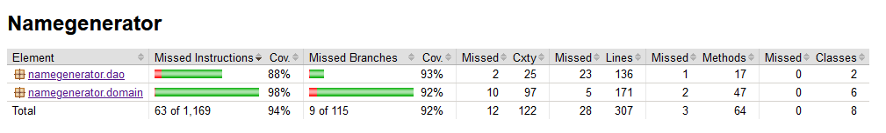

# Testausdokumentti
Ohjelmalle on olemassa JUnitilla kirjoitetut yksikkö- ja integraatiotestit. Lisäksi sovelluksen
toimintaa on testattu manuaalisesti varsinkin käyttöliittymän osalta.

## Yksikkö- ja integraatiotestaus
### Sovelluslogiikka
Tärkeimmät testit kohdistuvat `namegenerator.domain`-pakkaukseen ja erityisesti `Generator`-luokkaan. 
Generatorilla on riippuvuus `Language`-luokkaan, jolloin `GeneratorTest` toimittaa myös integraatiotestin virkaa.
Tilanteissa, joissa integraatiotesti ei riitä, on `Language`-luokalle myös kirjoitettu omat testit. 

Näiden lisäksi sovelluslogiikan luokille `Letter` ja `LetterWeight` on testit mm. *equals*-metodille ja 
sellaisille settereille, joiden kuuluu tuottaa virheilmoitus virheellisen tiedon kohdalla.

### DAO-luokat
`LanguageDao`-luokan toiminnallisuutta ja integroitumista tietokantaan on testattu käyttämällä erillistä
`test.db`-nimistä SQLite-tietokantaa. Testien yhteydessä tietokantaan syötetään testidataa, jota verrataan
 dao-luokan palauttamiin tuloksiin.
 
### Testikattavuus
UI-controllereita lukuun ottamatta sovelluksen testien rivikaatavuus on 94% ja haaraumakattavuus 92%. 

Testaamatta on dao-pakkauksessa tilanne, joissa yhteys tietokantaan epäonnistuu. Myöskään sellaisia 
gettereitä tai settereitä ei ole testattu, joilla ei ole erillistä sovelluslogiikkaa.

## Järjestelmätestaus
Sovelluksen järjestelmätestaus on suoritettu manuaalisesti. Testaus tehty Windows- ja Linux-ympäristöissä.

### Ohjelmalliset riippuvuudet
Sovelluksen testauksessa on oletettu, että laitteelle on asennettu [SQLite-tietokannan](https://www.sqlite.org/) 
hallintaan tarvittavat ohjelmistot. 

### Toiminnallisuudet
Kaikki [määrittelydokumentin](vaatimusmaarittely.md) toiminnallisuudet on käyty läpi. Tilanteissa, joissa 
virheellinen syöte on mahdollinen, myös virhetilanteet on testattu (kuten tyhjät arvot tai minimiarvon 
asettaminen suuremmaksi kuin maksimiarvo).

## Sovellukseen jääneet laatuongelmat
Sovelluksella ei tällä hetkellä ole keinoa palautua tietokannasta johtuvista virheistä eikä niistä palaudu 
virheilmoitusta käyttäjälle. Kuitenkaan tietokannan puute ei estä sovelluksen käyttämistä muutoin normaalisti.